# PLACRO

#### Code Institute Full Stack Development Diploma: Milestone Project 2 - Interactive Frontend Development
##### by Barry MacLennan

## Contents

1. [UX Development](#uxdev)
   - Project Goals
   - User Goals
   - User Stories
   - Site Owner Goals
   - Design Choices
      - Fonts
      - Icons
      - Colours
   - Site Map and Wireframes
   - Features & Future Releases 
2. [Testing](#testing)
   - HTML and CSS check using WC3
   - Peer Code Review
   - User stories
   - User testing
3. [Bugs and De-bugging](#bugs)
 
   - Known Issues
4. [Technologies Used](#tech)
   - Languages Used
   - Tools & Libraries Used
5. [Project Deployment](#deployment)
   - Deployment
   - Creating a Local Version
6. [References](#references)
7. [Acknowledgements](#acknowledge)

-------------

## UX Development 
### Project Goals

The project is to build a web app for people that wish to meal plan based on their macros as part of their fitness programme. Based on it being about planning your macros it will be called Placro.

Macros are the major nutrients in food; Protein, Carbohydrates, and Fat. Depending on the aim of the person, these are tweaked based on current body measurements to provide a goal.

Taking the key body measurements, Placro will advise on the calorie target along with the breakdown of macros that will help achieve it. Using this the site will then present recipes to fit different meals of the day for the user to build a full meal plan, ensuring the items they choose fall within their chosen target.

The scope of this project will be to utilise HTML, CSS, and Javascript to build the app, format the content and manage the interactivity required for the user to get the output they desire. 

The site will use the principles detailed in the fitness book Bigger Leaner Stonger by Mike Matthews.

### User Goals
Users of this site will be visiting for a number of reasons but the primary reasons will be:
- Find out what their target calories and macros should be based on their goals
- Find recipes to be able to build a meal plan that meats their goals
- Easily access a shopping list to refer to for purchasing the required ingredients for their meal plan

In a fully functioning web app, users would expect to be able to:

- log into an account and access their favourite recipes
- retrieve saved meal plans
- link their favourite to do list app or service

Below you will find more detailed user stories that help define the above goals and will be used in determing the feature set of the web site in this first release.

### User Stories
The users for this site will largely be male and have an interest in fitness. All users will be identified as **users** of the site for the scenarios listed below: 

- As a **user**, I want to **understand more about macros** and how they **help with meal planning**
- As a **user**, I want to be able to **calculate my daily calorie and macros targets** to build a meal plan that **meets my goals**
- As a **user**, I want to be able to **view recipes for various meals** for any part of the day to **create a varied meal plan**
- As a  **user** I want to be able to **select meals to build a meal plan** and see how **each meal added impacts on my daily targets**
- As a **user**, I want to be able to **save my selections** and **revisit them later**
- As a **user** I want to be able to **easily create a shopping list** so that I can **purchase the ingredients that I need** to make my chosen meals
- As a **user** I want to be able to highlight **particular recipes as favourites** so they are **easy to find when I revisit the site**
- As a **user** I want to be able to **export ingredients lists** to my **favourite to do list app**
- As a **user** I want to be able to **research more into the source material** to see the **detail behind the programme**

### Site Owner Goals
The site owner has the following goals that they wish to achieve from this project:
- Show what the **web app is about**
- Highlight the **uniqueness of macros for meal planning**. Which ensures all relevant nutrients are consumed to **sustainably build muscle**.
- **Drive sales of the Bigger, Leaner, Stronger book** by linking through to the website 
- Be mobile friendly with a **responsive layout design** for a smooth desktop experience
- Be **clean and simple** in design and not be perceived as overloaded and cluttered with excessive content

### Design Choices
A sample prototype page can be found [here]() which shows the fonts and colourways that will be used as the basis for this project.

#### Data
The scope of this project only includes frontend web technologies and tools. The web app itself would lend itself to the use of backend technologies to provide a fully individualised experience for the user.

To work around this, various different front end tools will be used to provide the feeling of an individual 'registered' user experience. This will be achieved by:

- Using the Web API to access and manage local and session storage so store key information based on user actions and selections
- Using JSON data format files to store required data in place of a backend database.

#### Fonts 
To ensure that the site presents information well. I have chosen the Rubik & Karla google fonts with Rubik to be used for headers while Karla will be used for body text.

#### Colours
Using coolors I have selected a selection of simple, high contrast colours.
- Links and interactivity are denoted with the orange colour throughout the site
- the cyan/blue is used to help highligh an interactive element on hover

#### Icons
In addition to the fonts and colourway, there are a few icons to be used through the site. These are sourced from Font Awesome and will be used to help direct users and sign post relevant sections using expected conventions. 

### Site Map and Wireframes
To help ensure that the site contains all of the required information I have created simple wireframes as a framework, using the User Stories and Site Owner Goals to ensure that all of the required features for this release are present.

The site is made up of 5 pages. All of the wireframes were created mobile first, with subsequent wireframes showing the view on a tablet and desktop.
Below is the wireframe for the Home page in mobile view.

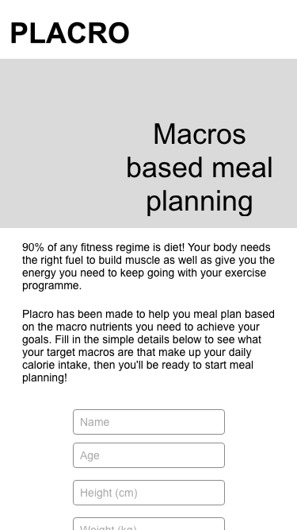

- Home page: [Tablet](design/wireframe/hometabletview.png) | [Desktop](design/wireframe/homedesktopview.png)
- Goals page: [Mobile](design/wireframe/goalmobileview.png) | [Tablet](design/wireframe/goaltabletview.png) | [Desktop](design/wireframe/goaldesktopview.png)
- Targets page: [Mobile](design/wireframe/targetmobileview.png) | [Tablet](design/wireframe/targettabletview.png) | [Desktop](design/wireframe/targetdesktopview.png)
- Return page: [Mobile](design/wireframe/returnmobileview.png) | [Tablet](design/wireframe/returntabletview.png) | [Desktop](design/wireframe/returndesktopview.png)
- Recipe page: [Mobile](design/wireframe/recipemobileview.png) | [Tablet](design/wireframe/recipetabletview.png) | [Desktop](design/wireframe/recipedesktopview.png)
- Meal plan page: [Mobile](design/wireframe/mealplanmobileview.png) | [Tablet](design/wireframe/mealplantabletview.png) | [Desktop](design/wireframe/mealplandesktopview.png)
- Shopping list page: [Mobile](design/wireframe/listmobileview.png) | [Tablet](design/wireframe/listtabletview.png) | [Desktop](design/wireframe/listdesktopview.png)
- Shopping list page: [Mobile](design/wireframe/aboutmobileview.png) | [Tablet](design/wireframe/abouttabletview.png) | [Desktop](design/wireframe/aboutdesktopview.png)

### **Features & Future Releases**
For this initial release, the web app for Placro will include the following item IDs from the features and requirements list above and will be in scope:

- Allow people to learn about macros and how they impact meal planning.
- Be able to calculate a daily calorie intake to support a fitness regime
- Choose recipes that cover different meals throughout the day to build up a meal plan
- Meals selected should be reflected in the calorie / macro target numbers so it is clear to see the remaining values left to complete the plan
- For ease of use the recipes should be summarised showing their calories and macros, but be able to be selected to view full recipe details 
- Ingredients should be listed to help form a shopping list to aid in purchasing items needed to make the meal plan 
- Site should remember the users selections and key measurements when they return to the site if they choose for this information to be saved
- Provide links to the source material should users wish to find out more about the fitness programme developed within the book

The site should be built to ensure that it is accessible to those that make use of screen readers to access content online.

For this first release, all items listed in v1.0 below are in scope of this project and scheduled for release October 2020, with the remaining features appearing in future releases as shown:

*Placro v1.0 - Release October 2020*:
- Allow people to learn about macros and how they impact meal planning.
- Be able to calculate a daily calorie intake to support a fitness regime
- Choose recipes that cover different meals throughout the day to build up a meal plan
- Meals selected should be reflected in the calorie / macro target numbers so it is clear to see the remaining values left to complete the plan
- For ease of use the recipes should be summarised showing their calories and macros, but be able to be selected to view full recipe details 
- Ingredients should be listed to help form a shopping list to aid in purchasing items needed to make the meal plan 
- Site should remember the users selections and key measurements when they return to the site if they choose for this information to be saved
- Provide links to the source material should users wish to find out more about the fitness programme developed within the book

*Placro v2.0 (Release date TBC)*:
- Ability to save / send shopping list to a to do list app of the users choice (via an API connection)Allow customers to book appointment online for services

*Placro v3.0 (Release date TBC)*:
- Users can login and keep track of their stats, manage favourite recipes and save meal plans

_[Back to Contents](#Contents)_

-------------

## Testing 
### HTML and CSS check using WC3
   - All html, CSS, and Javascript files were validated using the W3C validation tools. This did highlight some errors and warnings in relation to the use of some tags and the nesting of tags:  

### User story review
To validate that the site achieves the goals set out in the planning stage, below are the user stories that satisfy each requirement in this release.

- As a **user**, I want to be able to **calculate my daily calorie and macros targets** to build a meal plan that **meets my goals**
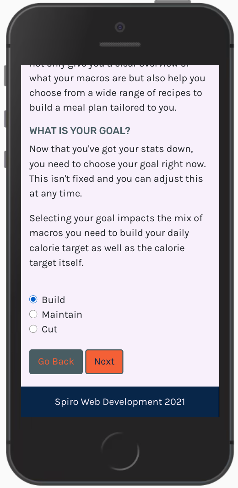 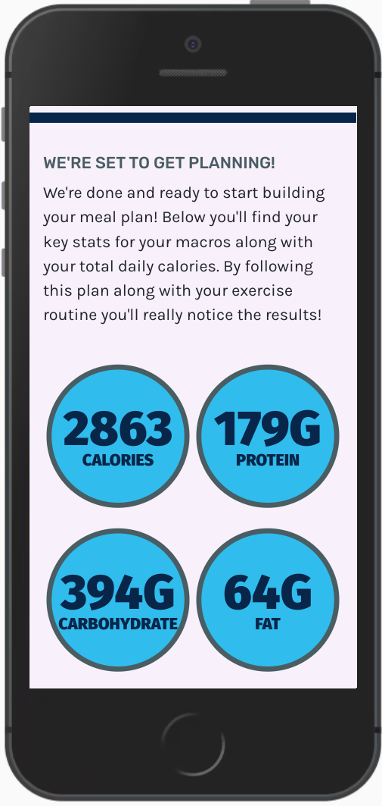 
- As a **user**, I want to be able to **view recipes for various meals** for any part of the day to **create a varied meal plan**
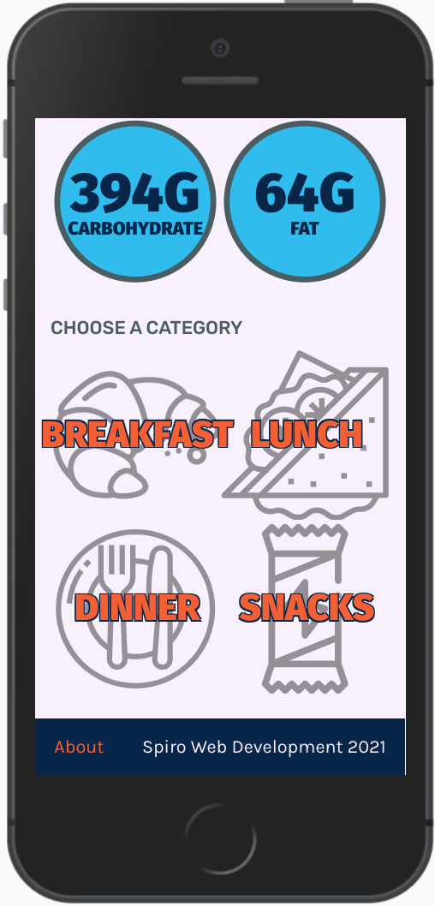
- As a  **user** I want to be able to **select meals to build a meal plan** and see how **each meal added impacts on my daily targets**
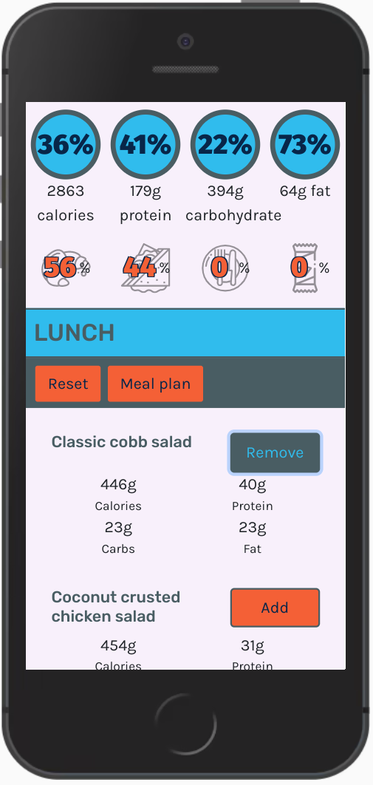
- As a **user**, I want to **understand more about macros** and how they **help with meal planning**
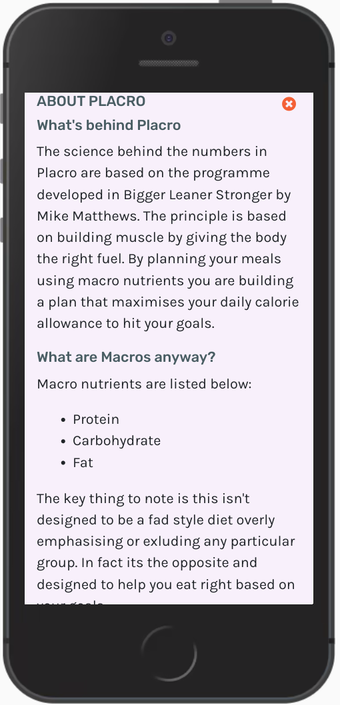
- As a **user**, I want to be able to **save my selections** and **revisit them later**
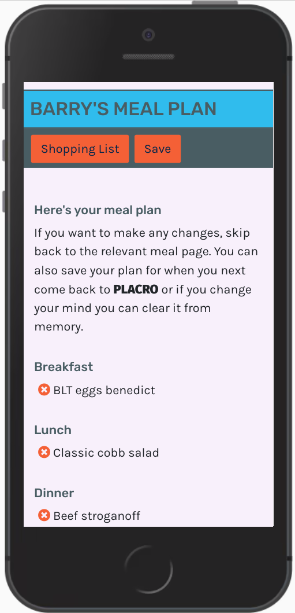 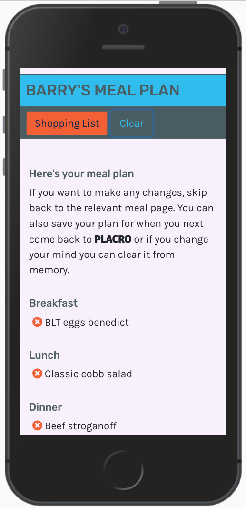 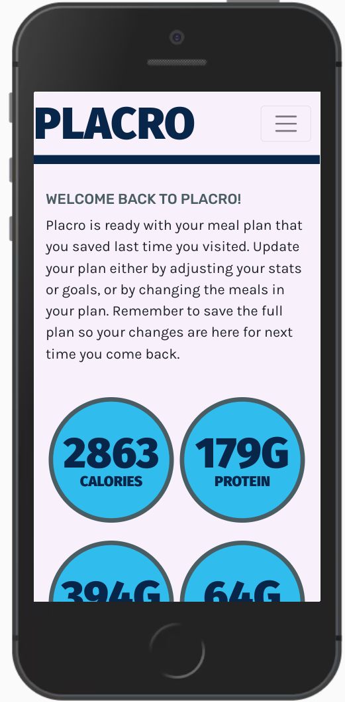 

- As a **user** I want to be able to **easily create a shopping list** so that I can **purchase the ingredients that I need** to make my chosen meals
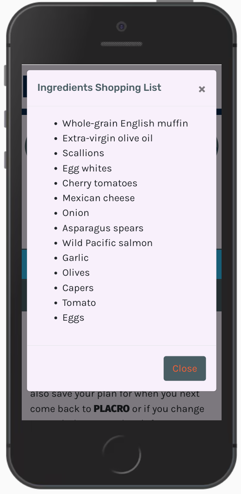
- As a **user** I want to be able to **research more into the source material** to see the **detail behind the programme**
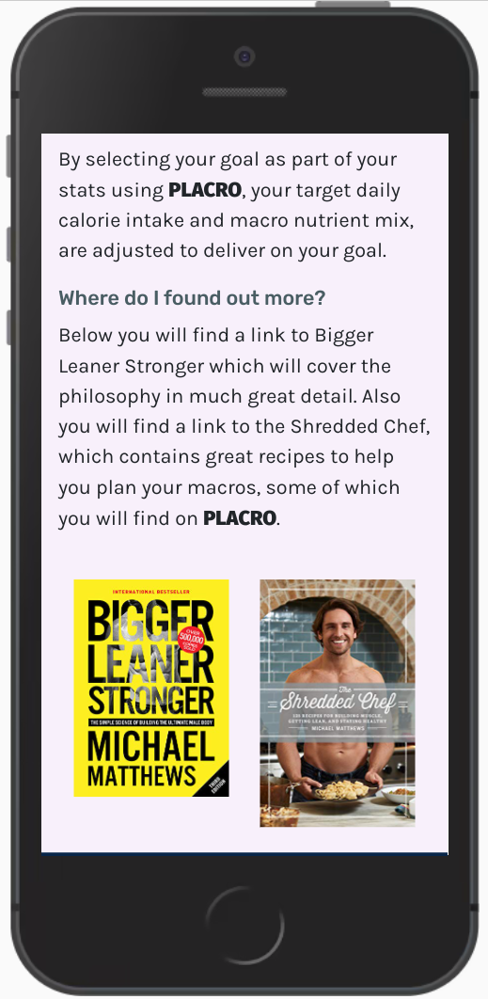

The below user stories have not been satisfied in this release:
- As a **user** I want to be able to highlight **particular recipes as favourites** so they are **easy to find when I revisit the site**
- As a **user** I want to be able to **export ingredients lists** to my **favourite to do list app**

### Development led testing - Jasmine
As part of the building the site, Jasmine was used to start the development in a test driven manor. As the the app developed my lack of experience with Javascript made utilising Jasmine to its full potential difficult.

Jasmine was used to test the calcualation logic of the stats that underpin the site at the beginning of development. This helped to build the functions that took the various user provided stats and output the desired results. As the app developed the data structures changed which now makes the Jasmine tests in place redundant.

### User testing
The web app was share with various users along with the test user stories. In general users were happy with the site and how it handled their journey noting the ease of use. The functionality of the user stories included in this version worked as expected. Bugs and issues are noted in the following section.

### Peer code review
Placro was share with my student peers at Code Institute via Slack.A handful of bugs were identified and listed as part of the below section content.

_[Back to Contents](#Contents)_

-------------
## Bugs and De-bugging 

- Form measurements switch failed to work
    - **Issue**: Web app captures event when user switches between imperial and metric. This was failing when deployed.
    - **Fix**: Correct a variable was incorrectly names causing the event to fail in completing.

- Lack of direction on meal plan builing page
    - **Issue**: Users found that once they finished selecting their meals, they were unclear where to go next.
    - **Fix**: On mobile screen formats where the menu is collapsed, added a `Meal plan` button which takes user forward to the meal plan summary page. 

- Header copy crashing with buttons on mobile screens
    - **Issue**: On mobile screens, any buttons used to aid navigation broke their containers and impacted on header copy making the site difficult to read.
    - **Fix**: Added a new sub-header to hold any buttons when on mobile screens. When the screen crosses a particular size this is hidden and the buttons return to the header bar.

- New header buttons not reacting to events
    - **Issue**: The new header buttons were not reacting to their associated events due to the event targeting IDs. As the buttons were duplicated in the HTML the second button was getting missed.
    - **Fix**: Changed elements to have a class identifier vs id and amended the event to react to Class IDs instead.

- Spelling mistakes
    - **Issue**: Various spellings and typos as well as inconsistent formatting of Placro name
    - **Fix**: Corrected typos and wrapped relevant 'Placro' in stylised  `` tags and redeployed.

- Initial stats form not returning
    - **Issue**: The 'Go Back' button returned a 404 error when used to go back and re-enter / amend any stats. This same issue affected any code that made a page reference for checking the current page or loading the next page in a number of areas.
    - **Fix**: Correct the `window.location.assign` function to ensure it copes with various types of deployment.

### Known Issues
Below is a list of known bugs that are either not able to be resolved at this time due or are outside the scope of this project. They will be factored into the development of future releases to have them resolved.

- recipe.JSON
    - Placeholder images assigned to each recipe type
    - Recipe description not currently included, data contains placeholder text
    - Recipe ingredients is placeholder text

- Planner.html
    - Recipe header incorrect colour, should be orange to denote link / interactive inline with site design

- Menu navigation
    - Your stats section does not show labels to correcly identify content to signpost meaning to user

_[Back to Contents](#Contents)_

-------------
## Technologies Used 

### Languages Used
- HTML5 - base content creation
- CSS3 - site styling
- Javascript - for all site interactivity
- JSON - used as a datastore as the scope of this project does not utilise backend development

### Tools and Libraries Used
- GitPod, Git and GitHub - Used to create code, manage version control and host the project
- Balsamiq - Wireframing tool for README and project planning stages
- Bootstrap - CSS framework for page layouts
- google fonts - all fonts in use on the site  
- Cooolors.co - a hex color pallette building site
- Font Awesome - for iconography throughout the site
- pexels - royalty free stock images
- compressjpeg - image compression site

_[Back to Contents](#Contents)_

--------------
## Project Deployment 

Detailed below is how this project has been deployed and also contains information should you wish to use locally on your machine. The project has been created and managed using Git in GitPod pushing all code to GitHub which is included in the below instructions.

### Deployment:
- Once project was pushed to **GitHub**, I went to the [GitHub](https://github.com/) site
- Logged in using my username and password
- Navigated to the correct repository page **[bazmac81/placro](https://github.com/bazmac81/placro)**
- Clicked on the **Settings** option
- Scrolled down to the **"GitHub Pages"** section
- Selected the **"master branch"** as the **source**
- Confirmed my selection to maked the page live
- Placro is now live using GitHub Pages
- *Note: There may be a short delay from selecting the source to the page going live. You will see a green background where your site address is shown to confirm when the page is live*

### Creating a Local Version:
1. Navigate to the correct repository page **[bazmac81/placro](https://github.com/bazmac81/placro)**
2. Click the green **Clone** button
3. Depending on how you wish to access the files you can either:
   - **Copy** the **https:** link displayed using the **clipboard** icon
   - Open the **Terminal** on your machine
   - Change the current directory to where you wish to save these files to
   - Type `git clone https://github.com/bazmac81/placro`
   - Press **Enter** to create your local files \
_or_
   - Click the **Download.zip** to download a zip file
   - Once downloaded, extract this to your chosen directory
4. Full details and support for creating a clone can be found [here](https://help.github.com/en/github/creating-cloning-and-archiving-repositories/cloning-a-repository)

_[Back to Contents](#Contents)_

-------------
## References 

Support files on Code Institute's Slack space:
- _List any files used here_

Reference Books I have used when building this site:
- [HTML & CSS: Design and build websites by Jon Duckett](http://www.htmlandcssbook.com/) - to easily look up key terms / attribute names etc.
- [Javascript and JQuery: Interactive front-end web development by Jon Duckett](http://www.javascriptbook.com/) - to easily look up key terms / attribute names etc.
- [Bigger, Leaner, Stronger by Mike Matthews](www.bls.com) - The source material behind the workings for the Placro web app

Reference sites to build knowledge on technologies covered in the first 3 modules of the course; HTML Fundamentals, CSS Fundamentals, and User Centric Frontend Development:
- [stackoverflow](https://www.stackoverflow.com) - used for general trouble shooting and answers to questions for issues.
- https://zellwk.com/blog/looping-through-js-objects/ - used to understand how to loop through object content
_[Back to Contents](#Contents)_

-------------
## Acknowledgements 
Thanks go to a  number of people that have helped support me in pulling together my first project.

My mentor Can, thanks for your time and guiding me through pulling this together.

The CI Student population on Slack for their general helpfulness and motivation!

_[Back to Contents](#Contents)_